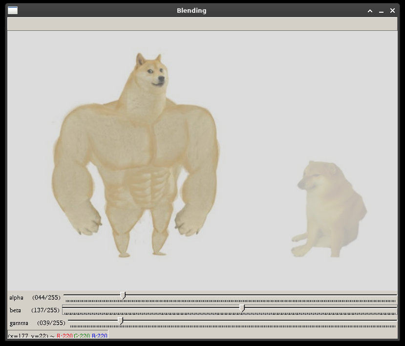

# image-blending-opencv

A simple example of blending 2 images.

To execute: run `python main.py`.

To exit: press `ESC`.

---

A simple example that shows effects of alpha, beta, gamma.

To execute: run `python main2.py`.

To exit: press `ESC`.

